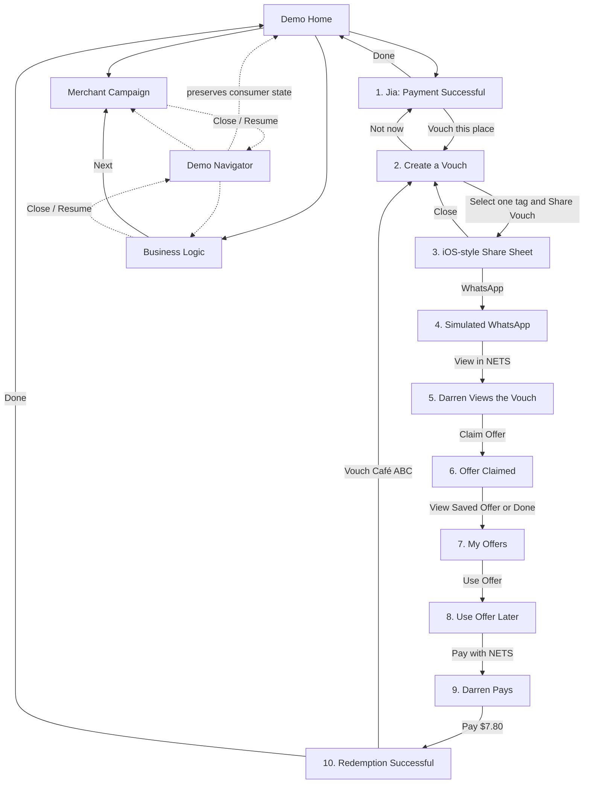
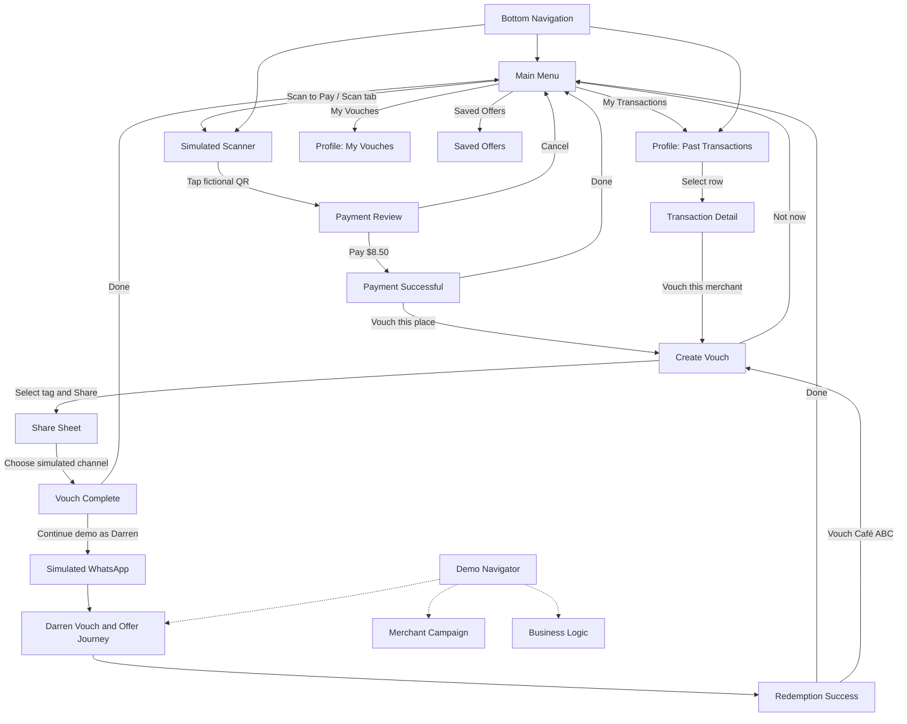

# NETS Vouch Prototype Plan

## 1. Project summary

NETS Vouch is a polished, front-end-only prototype demonstrating how a completed NETS payment can lead to a trusted recommendation, an optional merchant-funded offer, a later NETS purchase, and the next Vouch.

**Tagline:** One payment creates the next.

The primary Jia story is now:

> Main Menu → Scan to Pay → tap simulated QR code → review payment → pay → payment successful → optionally Vouch → Vouch confirmation → Main Menu.

The confirmation also offers an optional continuation into the preserved end-to-end branch:

> Jia shares her Vouch → Darren receives it through simulated WhatsApp → claims an optional merchant-funded offer → visits later → pays with NETS → redeems the offer → creates the next Vouch.

This is a clickable demonstration using fictional mock data. It will contain no backend, database, authentication, real payment processing, external messaging integration, or real personal information.

`PROTOTYPE_PLAN.md` will be the implementation source of truth. After approval, the first implementation action is to save this document at the repository root. Its progress checklists will be updated as work is completed.

Repository starting point:

- Clean `main` branch at the initial commit.
- Existing files are limited to `README.md` and `.gitattributes`.
- No application framework, package manager, hosting manifest, or prior source code exists.
- Existing Git configuration and history must remain intact.

## 2. Product principles

1. **Payment comes first.** Vouching is offered only after the NETS payment has succeeded.
2. **Recommendation and incentive remain separate.**
   - Jia’s Vouch is the trusted recommendation.
   - Café ABC’s offer is an optional, merchant-funded conversion mechanism.
3. **Will get referrer reward.** Jia will only receive merchant rewards only if Darren successfully paid and claimed his reward.
4. **Claim now, use later.** Darren saves the offer to his simulated NETS account and redeems it only during a later eligible payment.
5. **Single-use and account-linked.** The prototype state must prevent a claimed offer from being claimed twice or a redeemed offer from being reused.
6. **No promo code.** The offer is represented as an account-linked entitlement, never as a reusable code.
7. **One payment creates the next.** Darren’s successful payment ends with a new Vouch action that loops to Vouch creation.
8. **Prototype honesty.** Simulated payment, WhatsApp, account, fee, and campaign states must be clearly presented as illustrative.
9. **Focused storytelling.** Every screen and control must support the consumer loop, merchant setup, or business rationale.
10. **Accessible interaction.** Keyboard operation, clear focus, comfortable touch targets, readable contrast, and reduced-motion support are required.

## 3. Scope

The prototype includes:

- A discreet demo home/navigator.
- Ten consumer-flow screens forming one continuous journey.
- A simulated iOS-style share sheet.
- A simulated WhatsApp conversation.
- A merchant campaign setup screen.
- A business-logic comparison screen.
- Stateful tag selection, offer claiming, offer redemption, campaign launch, navigation history, and demo restart.
- A desktop iPhone-style shell and natural full-screen mobile presentation.
- Responsive, accessible, keyboard-operable interactions.
- Local development and static production builds suitable for later Vercel deployment.
- Focused automated tests for important state transitions and interactions.
- A manual end-to-end click-through checklist.

## 4. Explicit non-goals

The prototype will not include:

- A backend, API server, database, authentication, or real user accounts.
- Real payments, bank selection, card details, NETS credentials, QR payment, or financial data.
- Real WhatsApp, Telegram, Messages, contacts, deep links, or external navigation.
- Real personal information or real merchant records.
- Rewards for the person who Vouches.
- Reusable promo codes or transferable offer codes.
- XP, streaks, levels, leaderboards, or gamification.
- Public Vouch feeds, follower systems, social profiles, comments, or likes.
- Reviews, captions, photo uploads, or star ratings.
- AI recommendations, group voting, or collaborative decisions.
- Cashback wallets or balances.
- A large merchant analytics dashboard.
- Production-grade campaign configuration or merchant onboarding.
- Production claims about NETS pricing, savings, or guaranteed redemption results.
- Reuse of the old prototype’s code, product concept, screen designs, content, or navigation.
- Deployment during the initial implementation unless separately requested.

## 5. User-flow diagram



The final transition from Screen 10 to Screen 2 changes the current Vouch author to Darren, clears the previous tag selection, and displays a short “next Vouch” confirmation so the loop is visually explicit.

## 6. Screen-by-screen specification

> **Extension note:** Section 20 supersedes the original Demo Home as the initial screen. The proper Main Menu is now the default, while the discreet Demo Navigator retains access to the focused consumer, merchant, and business demonstrations.

### Demo Home

**Purpose:** Provide a discreet starting point and access to each demonstration area.

**Content:**

- NETS Vouch
- One payment creates the next.
- Brief prototype label.
- Consumer Journey card.
- Merchant Campaign card.
- Business Logic card.
- Resume Journey label when consumer progress exists.
- Discreet restart control.

**Behaviour:**

- Consumer Journey opens Screen 1 on a fresh session or resumes the saved consumer screen.
- Merchant Campaign and Business Logic open independently while preserving consumer state.
- Restart clears all consumer and campaign state after an explicit second tap or confirmation.

### Screen 1 — Jia’s payment succeeds

**Content:**

- Strong success icon and **Payment Successful** heading.
- Café ABC.
- **$8.50**.
- Paid with NETS.
- Done.
- A visually separate recommendation card:
  - Worth sharing?
  - Vouch this place.

**Behaviour:**

- The receipt is already complete before the Vouch card appears.
- Vouch this place opens Screen 2 with Jia as the current author.
- Done returns to Demo Home and preserves the completed receipt state for resumption.
- No payment input or banking information is shown.

### Screen 2 — Create a Vouch

**Content:**

- Worth sharing?
- Vouch for Café ABC.
- Single-select tags:
  - Vouch Pick
  - Good Value
  - Worth It
  - Good Hangout
- Share Vouch.
- Not now.
- On the looped visit, a compact banner states that Darren’s verified NETS visit can create the next Vouch.

**Behaviour:**

- Tags behave as an accessible single-selection radio group.
- No tag is selected initially.
- Share Vouch remains disabled until a tag is selected and includes visible helper text explaining why.
- Selecting a tag updates the selected visual state and enables Share Vouch.
- Share Vouch opens Screen 3.
- Not now returns to Screen 1 with “Vouch skipped — payment remains complete” feedback.
- No review, caption, photo, or star-rating control is present.

### Screen 3 — Native share sheet

**Presentation:** An iOS-style bottom sheet within the phone, with a dimmed background and dialog semantics.

**Content:**

- Jia Vouched for Café ABC on the first cycle.
- The selected Vouch tag.
- Verified NETS Visit.
- WhatsApp.
- Telegram.
- Messages.
- Copy link.
- Close control.

**Behaviour:**

- WhatsApp continues to Screen 4.
- Telegram and Messages remain inside the prototype and show “Simulated sharing option” feedback.
- Copy link shows “Demo link copied” feedback without requiring clipboard permission or exposing a real reusable code.
- Close returns to Screen 2 with the selected tag preserved.
- After the final loop, the author line changes to Darren.

### Screen 4 — Darren receives the WhatsApp message

**Presentation:** A recognisable but clearly labelled simulated WhatsApp conversation.

**Content:**

- Simulated WhatsApp header.
- Conversation with Darren.
- Message from Jia: “bro this place quite good HAHA”.
- Shared Vouch card:
  - Jia Vouched for Café ABC.
  - Selected tag.
  - Verified NETS Visit.
  - View in NETS.

**Behaviour:**

- View in NETS transitions internally to Screen 5.
- Back returns to the share sheet.
- No external application, URL, contact, or messaging service is opened.

### Screen 5 — Darren views the Vouch in NETS

**Content:**

Recommendation section:

- Café ABC.
- Jia Vouched for this place.
- Selected tag.
- Verified NETS Visit.

Separate offer section:

- Optional NETS Vouch Offer.
- Free Matcha Latte Upsize.
- with eligible NETS payment.
- Funded by Café ABC.
- Claim Offer.
- one per user.
- Valid until 30 September 2026.

**Behaviour:**

- Recommendation and offer use distinct cards, headings, labels, and background treatments.
- Claim Offer changes the state from available to claimed and opens Screen 6.
- Returning after claiming shows an Offer claimed state instead of another claim action.
- Back returns to Screen 4 without losing the selected Vouch tag.

### Screen 6 — Offer claimed

**Content:**

- Offer saved.
- Free Matcha Latte Upsize.
- Café ABC.
- Claimed.
- Valid until 30 September 2026.
- “Use it when you visit Café ABC and pay with NETS.”
- View Saved Offer.
- Done.

**Behaviour:**

- View Saved Offer opens Screen 7 and highlights the saved card.
- Done also opens Screen 7, with a short “Saved to My Offers” confirmation.
- Back returns to Screen 5 while preserving claimed status.

### Screen 7 — My Offers

**Content:**

- My Offers heading.
- Saved offer card:
  - Café ABC.
  - Free Matcha Latte Upsize.
  - From Jia’s Vouch.
  - Claimed.
  - Valid until 30 September 2026.
  - Use Offer.

**Behaviour:**

- Use Offer opens Screen 8.
- A subtle “Later, at Café ABC” transition label establishes that redemption occurs on a later visit.
- Back follows the screen history without clearing the claim.

### Screen 8 — Use the offer later

**Content:**

- Café ABC.
- Free Matcha Latte Upsize.
- Ready to use.
- Eligible NETS payment required.
- One-time use.
- Valid until 30 September 2026.
- Pay with NETS.

**Behaviour:**

- Pay with NETS opens Screen 9.
- Back returns to My Offers.
- This screen can only be reached while the offer is claimed and not redeemed.

### Screen 9 — Darren pays

**Content:**

- Pay Café ABC.
- **$7.80**.
- Vouch Offer Applied.
- Free Matcha Latte Upsize.
- Pay **$7.80**.
- Small “Simulated NETS payment” label.

**Behaviour:**

- Pay $7.80 performs a simulated payment, changes the offer state to redeemed, and opens Screen 10.
- The Pay button shows brief pressed/loading feedback before the success transition.
- Back returns to Screen 8 without changing the claim state.
- No bank, account, card, QR, or payment credential fields appear.

### Screen 10 — Redemption succeeds

**Content:**

- Strong success icon and **Payment Successful**.
- Café ABC.
- Vouch Offer Redeemed.
- Free Matcha Latte Upsize.
- Worth sharing?
- Vouch Café ABC.
- Done.

**Behaviour:**

- Vouch Café ABC begins the next cycle by returning to Screen 2.
- The next cycle uses Darren as the Vouch author, clears the old tag, and displays a “New verified visit — create the next Vouch” confirmation.
- Done returns to Demo Home with the completed-cycle state visible.
- The redeemed offer can no longer be used again.

### Merchant campaign screen

**Content:**

- Create Vouch Offer.
- Merchant: Café ABC.
- Offer: Free Matcha Latte Upsize.
- Redemption limit: 100.
- Validity period: 28 August–30 September 2026.
- Eligible outlet: Café ABC — Orchard Demo Outlet.
- One redemption per customer.
- Estimated maximum redemptions: 100.
- Merchant-funded.
- Merchant-controlled.
- Launch Campaign.

**Behaviour:**

- Values are presented as a focused campaign summary rather than a production form.
- Launch Campaign changes the campaign state from draft to launched.
- A success banner states “Campaign launched for this demo”.
- The button becomes a non-action status button labelled Campaign launched.
- Back returns to the preceding supporting screen or Demo Home.
- Close resumes the consumer journey at its exact prior screen.

### Business-logic screen

**Content:**

- Card payment: **2.50%**.
- NETS: **0.80%**.
- Part of the potential acceptance-cost difference can fund a small customer perk.
- Merchant receives a referred customer.
- Disclaimer: **Illustrative published rates. Actual merchant fees vary.**
- Back.
- Next.

**Behaviour:**

- Rates appear as a compact comparison, not as guaranteed savings or a dashboard.
- Next opens the Merchant Campaign screen.
- Back returns to Demo Home or the previous supporting screen.
- Close resumes the preserved consumer journey.

## 7. Interaction map

### Global controls

| Control | Location | Result |
|---|---|---|
| Demo | Discreet phone header control | Opens the demo navigator without changing consumer state |
| Consumer Journey / Resume Journey | Demo Home and navigator | Starts at Screen 1 or resumes the current consumer screen |
| Merchant Campaign | Demo Home and navigator | Opens the merchant screen while preserving consumer state |
| Business Logic | Demo Home and navigator | Opens the business-logic screen while preserving consumer state |
| Restart Demo | Demo Home and navigator | Confirms, then resets tag, author, offer, redemption, campaign, history, and feedback state |
| Close | Demo navigator | Closes the overlay and returns focus to the control that opened it |
| Back | Applicable screens | Pops the internal history stack without reversing claimed or redeemed state |
| Supporting-screen Close | Merchant and business screens | Returns to the preserved consumer screen |
| Next | Business-logic screen | Opens Merchant Campaign |

### Consumer controls

| Screen | Control | Result and state effect |
|---|---|---|
| 1 | Vouch this place | Opens Screen 2 with Jia as author |
| 1 | Done | Returns to Demo Home; receipt remains complete |
| 2 | Each Vouch tag | Selects exactly one tag and enables Share Vouch |
| 2 | Share Vouch | Opens Screen 3; disabled only while no tag is selected |
| 2 | Not now | Returns to Screen 1 with skip feedback |
| 2 | Back | Returns to Screen 1 |
| 3 | Close | Returns to Screen 2 with tag preserved |
| 3 | WhatsApp | Opens Screen 4 |
| 3 | Telegram | Shows simulated-option feedback; remains on Screen 3 |
| 3 | Messages | Shows simulated-option feedback; remains on Screen 3 |
| 3 | Copy link | Shows demo-copy feedback; remains on Screen 3 |
| 4 | Back | Returns to Screen 3 |
| 4 | View in NETS | Opens Screen 5 |
| 5 | Back | Returns to Screen 4 |
| 5 | Claim Offer | Sets offer to claimed and opens Screen 6 |
| 5 | View Saved Offer | Replaces Claim Offer after claiming and opens Screen 7 |
| 6 | Back | Returns to Screen 5; claim persists |
| 6 | View Saved Offer | Opens Screen 7 |
| 6 | Done | Opens Screen 7 with saved confirmation |
| 7 | Back | Returns through history; claim persists |
| 7 | Use Offer | Opens Screen 8 |
| 8 | Back | Returns to Screen 7 |
| 8 | Pay with NETS | Opens Screen 9 |
| 9 | Back | Returns to Screen 8 without redeeming |
| 9 | Pay $7.80 | Simulates payment, sets offer to redeemed, opens Screen 10 |
| 10 | Vouch Café ABC | Sets author to Darren, clears selected tag, and opens Screen 2 |
| 10 | Done | Returns to Demo Home with cycle-complete status |

Disabled controls must use genuine disabled semantics and explanatory text. All enabled controls must either navigate, change visible state, or provide visible feedback.

## 8. Visual design system

### Brand direction

A fresh, trustworthy Singapore-fintech aesthetic using NETS-inspired—not copied—red, blue, and white accents.

### Core tokens

| Token | Intended value/use |
|---|---|
| Primary blue | Deep navy-blue, approximately `#083B66`, for headings and trust cues |
| Action red | Warm NETS-inspired red, approximately `#D9272E`, for primary actions and highlights |
| Success green | Approximately `#087A55`, for successful payment and saved states |
| Background | Soft blue-grey, approximately `#F3F6F9`, outside the phone and behind grouped content |
| Surface | White for primary cards and sheets |
| Text | Near-black navy, approximately `#142332` |
| Muted text | Cool grey with WCAG-compliant contrast |
| Border | Subtle cool-grey border |
| Focus ring | High-contrast blue ring with visible offset |

Exact colors must be contrast-checked before finalisation.

### Typography

- Use the native system stack: `-apple-system`, `BlinkMacSystemFont`, `"Segoe UI"`, and sans-serif fallbacks.
- No remote font request.
- Strong hierarchy:
  - Screen title: 26–30px.
  - Payment amount: 36–42px.
  - Section heading: 18–20px.
  - Body: 15–16px.
  - Supporting label: 12–14px.
- Use weight and spacing instead of excessive color variation.

### Components and styling

- White cards with 16–20px corner radii.
- Buttons with 14–16px corner radii and a minimum 48px height.
- Restrained 1px borders and soft shadows.
- Large success mark with no confetti or gamification.
- Vouch badges and Verified NETS Visit badges use different styling from offer status badges.
- Offer cards use a subtle tinted section and explicit “Optional” and “Merchant-funded” labels.
- The WhatsApp simulation uses familiar green accents but remains labelled as simulated.
- Status bar shows 9:41, signal, Wi-Fi, and battery indicators and is decorative to assistive technology.
- Use `lucide-react` for consistent interface icons; icons are supplementary to text labels.
- No remote imagery is required.

### Motion

- Screen transition: subtle 180–220ms fade/slide.
- Bottom sheets: short upward transition.
- Button press: restrained scale or color response.
- Success state: short checkmark reveal.
- All motion is removed or reduced when `prefers-reduced-motion: reduce` is active.

## 9. Technical architecture

### Recommended technology

Use **React with TypeScript and Vite**, managed with npm.

Justification:

- The journey contains meaningful shared state and repeated UI that benefit from React components.
- TypeScript makes screen IDs, tags, offer states, and reducer transitions explicit.
- Vite provides simple local commands and a static `dist/` output suitable for Vercel.
- The repository has no existing framework to preserve.
- React is understandable to beginners and avoids the routing and server complexity of a larger framework.

The workspace currently has Node.js 26.6.0 and npm 11.18.0. The project should document a compatible modern Node requirement and commit `package-lock.json`.

### Dependency policy

Runtime dependencies:

- `react`
- `react-dom`
- `lucide-react`

Development dependencies:

- Vite and the React plugin.
- TypeScript.
- ESLint with React, hooks, and JSX accessibility rules.
- Vitest.
- React Testing Library, `user-event`, and `jest-dom`.
- `jsdom` for component tests.

Do not add React Router, a state-management library, Tailwind, a component framework, an animation library, an HTTP client, or an end-to-end browser framework.

### Application structure

- `App` owns a typed `useReducer` state machine.
- A screen registry renders one active screen inside the phone shell.
- Reusable components receive data and event handlers through typed props.
- Screen transitions are internal; no external navigation or backend calls occur.
- Navigation uses an internal history stack instead of URL routes, keeping static hosting configuration minimal.
- Supporting screens use a separate return target so they never destroy consumer progress.
- A global feedback region displays toasts/status messages.
- State is session-memory only; refreshing intentionally resets the prototype.

### Public interfaces and APIs

- No public API, server endpoint, authentication interface, or external integration will be added.
- Internal TypeScript contracts will define `ScreenId`, `VouchTagId`, `OfferStatus`, `CampaignStatus`, `DemoState`, `DemoAction`, and mock-data records.
- Reducer guards will enforce valid claim, use, pay, redeem, back, restart, and loop transitions.

## 10. Proposed folder structure

```text
nets-vouch-prototype/
├── PROTOTYPE_PLAN.md
├── README.md
├── .gitattributes
├── .gitignore
├── package.json
├── package-lock.json
├── index.html
├── vite.config.ts
├── tsconfig.json
├── tsconfig.app.json
├── tsconfig.node.json
├── eslint.config.js
├── src/
│   ├── main.tsx
│   ├── App.tsx
│   ├── app/
│   │   ├── demoReducer.ts
│   │   ├── navigation.ts
│   │   └── types.ts
│   ├── components/
│   │   ├── BottomNavigation.tsx
│   │   ├── FictionalQrButton.tsx
│   │   ├── TransactionList.tsx
│   │   ├── VouchHistoryList.tsx
│   │   ├── PhoneShell.tsx
│   │   ├── StatusBar.tsx
│   │   ├── ScreenHeader.tsx
│   │   ├── Button.tsx
│   │   ├── FeedbackToast.tsx
│   │   ├── DemoNavigator.tsx
│   │   ├── VouchTagSelector.tsx
│   │   ├── VerifiedVisitBadge.tsx
│   │   ├── OfferCard.tsx
│   │   └── SuccessState.tsx
│   ├── screens/
│   │   ├── MainMenuScreen.tsx
│   │   ├── ScanToPayScreen.tsx
│   │   ├── PaymentReviewScreen.tsx
│   │   ├── ProfileScreen.tsx
│   │   ├── TransactionDetailScreen.tsx
│   │   ├── consumer/
│   │   │   └── one component per numbered consumer screen
│   │   └── supporting/
│   │       ├── MerchantCampaignScreen.tsx
│   │       └── BusinessLogicScreen.tsx
│   ├── data/
│   │   └── mockData.ts
│   ├── styles/
│   │   ├── tokens.css
│   │   ├── global.css
│   │   └── components.css
│   └── test/
│       ├── setup.ts
│       ├── demoReducer.test.ts
│       └── consumerFlow.test.tsx
└── public/
    └── favicon.svg or a simple non-infringing static favicon
```

Consumer screen filenames should be descriptive, such as `PaymentSuccessScreen.tsx`, `CreateVouchScreen.tsx`, and `RedemptionSuccessScreen.tsx`. The implementation may group very small screen-specific helpers with their parent screen instead of creating unnecessary files.

## 11. State and mock-data model

### Demo state

| Field | Purpose |
|---|---|
| `activeScreen` | Current screen inside the phone |
| `consumerScreen` | Last active consumer screen for resume behaviour |
| `history` | Internal Back-navigation stack |
| `supportingReturnScreen` | Consumer destination restored after closing a supporting screen |
| `selectedTag` | One selected Vouch tag or `null` |
| `currentAuthor` | Jia on the initial cycle; Darren after redemption |
| `cycleNumber` | Initial or next-Vouch cycle |
| `offerStatus` | `available`, `claimed`, or `redeemed` |
| `campaignStatus` | `draft` or `launched` |
| `paymentStatus` | Completed state for Jia and pending/completed state for Darren |
| `navigatorOpen` | Whether the demo navigator dialog is open |
| `notice` | Current visible and screen-reader-announced feedback |
| `isPaying` | Brief simulated payment-in-progress state |

### State rules

- Share is valid only after a tag is selected.
- Claim is valid only while the offer is available.
- Use Offer and Pay with NETS are valid only while the offer is claimed.
- Redemption can occur only once.
- Back navigation never silently rolls claimed or redeemed state backward.
- Supporting screens do not change consumer state.
- Restart returns all state to the defined initial values.
- Final Vouch changes the author to Darren, increments the cycle, and clears the tag.
- No state is persisted to local storage or sent over a network.

### Mock data

`mockData.ts` will be the single source for:

- Merchant:
  - Café ABC.
  - Café ABC — Orchard Demo Outlet.
- People:
  - Jia.
  - Darren.
- Payments:
  - Jia’s completed payment: SGD $8.50.
  - Darren’s later payment: SGD $7.80.
- Personal message:
  - “bro this place quite good HAHA”.
- Vouch tags:
  - Vouch Pick.
  - Good Value.
  - Worth It.
  - Good Hangout.
- Offer:
  - Free Matcha Latte Upsize.
  - Eligible NETS payment required.
  - Funded by Café ABC.
  - One per user.
  - Valid until 30 September 2026.
- Campaign:
  - Limit 100.
  - 28 August–30 September 2026.
  - Maximum estimated redemptions 100.
- Illustrative rates:
  - Card payment 2.50%.
  - NETS 0.80%.
  - Required fee disclaimer.

Dates and amounts remain centralised so they can be updated without editing presentation components.

## 12. Responsive and iPhone-shell behaviour

### Desktop and tablet

- Centre the phone horizontally and vertically on a soft neutral background.
- Target overall shell dimensions of approximately **393px × 852px**.
- Use approximately **44px** outer corner radii.
- Apply a subtle outer border and layered shadow.
- Allow the shell height to shrink to `calc(100dvh - 32px)` on shorter displays.
- Keep phone content scrolling internally rather than scrolling the surrounding desktop page.
- Hide decorative scrollbars while preserving scrolling.
- Keep key actions visible using sticky or anchored action areas only where they do not obscure content.

### Mobile

At approximately 430px wide or below:

- Fill `100vw × 100dvh`.
- Remove the outer shadow and border.
- Reduce or remove outer corner radii so the prototype feels native to the device.
- Respect `env(safe-area-inset-top)` and `env(safe-area-inset-bottom)`.
- Keep all content and actions reachable in portrait orientation.
- Use `overscroll-behavior` carefully to contain internal scrolling.
- Avoid fixed heights that cause clipping when mobile browser chrome changes.

### Phone layout

- Decorative status-bar region at the top.
- App header below the status bar.
- One internally scrollable screen region.
- Optional sticky CTA region at the bottom.
- Bottom navigation is omitted from the main journey unless testing shows it materially improves access to My Offers.
- Dialogs and share sheets remain clipped inside the phone frame.
- Focused elements must scroll into view when operated by keyboard.

## 13. Accessibility requirements

- Use semantic `<button>` elements for actions; do not use clickable generic containers.
- Provide a minimum target size of 44×44px and aim for 48px-high primary actions.
- Meet WCAG AA contrast:
  - 4.5:1 for normal text.
  - 3:1 for large text and meaningful interface graphics.
- Provide a clearly visible focus ring on every interactive element.
- Ensure logical tab order follows the visual order.
- Move focus to the screen heading after a screen transition.
- Return focus to the trigger after closing the share sheet or demo navigator.
- Implement share sheet and navigator as labelled dialogs with focus containment and Escape-to-close.
- Implement Vouch tags as a labelled radio group.
- Use `aria-live` or `role="status"` for:
  - Tag selection.
  - Demo share/copy feedback.
  - Offer claimed.
  - Campaign launched.
  - Payment processing and success.
  - Demo restarted.
- Do not communicate selected, claimed, or redeemed state by color alone.
- Mark status-bar decorations and supplementary icons as hidden from assistive technology.
- Give icon-only Close, Back, and Restart controls explicit accessible names.
- Honour `prefers-reduced-motion`.
- Keep body copy zoomable and usable at 200% browser zoom.
- Label simulated WhatsApp and payment surfaces clearly.
- Test the complete main flow using keyboard only.

## 14. Implementation phases

### Phase 0 — Approved plan and repository foundation

- [x] Save the approved plan as `PROTOTYPE_PLAN.md` before creating application code.
- [x] Mark the save-plan progress item complete immediately after the file exists.
- [x] Create the Vite/React/TypeScript project in place without replacing Git history.
- [x] Preserve the existing README content and expand it with setup instructions later.
- [x] Add npm scripts, TypeScript configuration, linting, testing, and `.gitignore`.
- [x] Generate and commit `package-lock.json`.

### Phase 1 — Architecture and visual foundation

- [x] Define mock data, internal types, reducer state, reducer actions, and navigation guards.
- [x] Implement design tokens, global styles, and responsive page background.
- [x] Build the iPhone shell, status bar, internal scrolling, screen transition wrapper, and safe areas.
- [x] Build reusable buttons, headers, cards, badges, tag selector, dialogs, feedback, and success-state components.
- [x] Build Demo Home, Demo Navigator, Back handling, Close handling, and Restart.

### Phase 2 — Jia’s Vouch and sharing journey

- [x] Implement Screen 1 payment success.
- [x] Implement Screen 2 Vouch creation and single-select tags.
- [x] Implement Screen 3 iOS-style share sheet.
- [x] Implement Screen 4 simulated WhatsApp conversation.
- [x] Implement Screen 5 NETS Vouch and clearly separate optional offer.
- [x] Verify the exact required copy and first half of the flow.

### Phase 3 — Claim, later use, payment, and loop

- [x] Implement Screen 6 offer claimed.
- [x] Implement Screen 7 My Offers.
- [x] Implement Screen 8 later-use offer state.
- [x] Implement Screen 9 simulated NETS payment.
- [x] Implement Screen 10 redemption success.
- [x] Implement redeemed-state protection and the Darren-to-next-Vouch loop.
- [x] Verify claim and redemption state survives Back and supporting-screen navigation.

### Phase 4 — Supporting demonstrations

- [x] Implement Merchant Campaign content and launched state.
- [x] Implement Business Logic comparison and required disclaimer.
- [x] Implement Back, Next, Close, and resume behaviour across supporting screens.
- [x] Verify supporting screens never overwrite consumer progress.

### Phase 5 — Quality and handoff

- [x] Add reducer and component interaction tests.
- [x] Complete keyboard, focus, contrast, reduced-motion, and screen-reader feedback checks.
- [ ] Test desktop shell and representative mobile viewport sizes.
- [ ] Complete the manual click-through.
- [x] Run lint, type-check, tests, and production build.
- [x] Update README with local commands, prototype limitations, and Vercel-ready build information.
- [x] Update all progress checklists in this plan to reflect actual completion.

## 15. Progress checklist

- [x] Approved plan saved as `PROTOTYPE_PLAN.md`.
- [x] Project scaffold and developer commands ready.
- [x] Mock data and state machine complete.
- [x] Phone shell and visual system complete.
- [x] Consumer Screens 1–5 complete.
- [x] Consumer Screens 6–10 complete.
- [x] Next-Vouch loop complete.
- [x] Merchant campaign screen complete.
- [x] Business-logic screen complete.
- [x] Responsive behaviour complete.
- [x] Accessibility requirements complete.
- [x] Automated tests passing.
- [ ] Manual click-through passing.
- [x] README and prototype disclaimers complete.
- [x] Production build passing.
- [x] Git milestones complete.
- [x] Main Menu, bottom navigation, and shortcuts complete.
- [x] Simulated Scan to Pay and payment review complete.
- [x] Scan payment creates and displays a new transaction.
- [x] Vouch completion confirmation and Darren continuation complete.
- [x] Jia Profile, Past Transactions, transaction detail, and My Vouches complete.
- [x] Saved Offers remains separate and reachable.
- [x] Extension reducer, navigation, and reset behaviour complete.
- [x] Extension automated tests passing.
- [ ] Extension manual click-through complete.

## 16. Testing and verification checklist

### Verification commands

Run from the repository root:

- [x] `npm install` for the first dependency installation and lockfile creation.
- [x] `npm run dev` to start local development.
- [x] `npm run lint` with no errors.
- [x] `npm run typecheck` with no TypeScript errors.
- [x] `npm run test` with all Vitest tests passing.
- [x] `npm run build` with a successful static production build.
- [x] `npm run preview` to inspect the production build locally.
- [x] Use `npm ci` for clean verification after `package-lock.json` exists.

### Automated scenarios

- [x] Initial state opens Main Menu with the original mock records, an unclaimed offer, and no selected tag.
- [x] Share Vouch is disabled until a tag is selected.
- [x] Selecting another tag replaces the prior selection.
- [x] The selected tag appears in the share sheet, WhatsApp card, and NETS Vouch screen.
- [x] Claim changes the offer to claimed exactly once.
- [x] Claimed state survives Back and supporting-screen navigation.
- [x] Use Offer and payment cannot be reached while the offer is available or redeemed.
- [x] Pay changes the offer to redeemed and reaches Screen 10.
- [x] A redeemed offer cannot be reused.
- [x] Final Vouch changes the author to Darren and clears the selected tag.
- [x] Demo navigator preserves the consumer screen.
- [x] Restart clears all state.
- [x] WhatsApp, Telegram, Messages, and Copy link complete the Vouch with visible simulated feedback.
- [x] Campaign launch changes the merchant screen’s status exactly once.

### Manual click-through

> Pending in-browser visual verification: no connected browser runtime was available in the implementation session. The reducer/component click-through tests, production build, semantic-control review, and responsive/reduced-motion CSS review passed; viewport appearance and physical browser focus behaviour remain deliberately unchecked below.

- [ ] Start Consumer Journey from Demo Home.
- [ ] Confirm Jia’s payment is already successful before the Vouch prompt.
- [ ] Open Create a Vouch and confirm Share is initially disabled.
- [ ] Select Good Value and confirm the selected style and enabled Share action.
- [ ] Open the share sheet and confirm all four share options.
- [ ] Trigger a non-WhatsApp share option and confirm visible simulated feedback.
- [ ] Continue through WhatsApp and confirm the required message and card copy.
- [ ] View the Vouch in NETS and confirm recommendation/offer separation.
- [ ] Claim the offer and confirm the saved status and validity date.
- [ ] Open My Offers and confirm the saved card.
- [ ] Use the offer later and confirm one-time and NETS-payment terms.
- [ ] Complete the simulated $7.80 payment.
- [ ] Confirm payment success and redeemed status.
- [ ] Vouch Café ABC and confirm return to Vouch creation as Darren.
- [ ] Use Back throughout the journey and confirm state remains coherent.
- [ ] Open Merchant Campaign mid-journey, launch it, close it, and resume the same consumer screen.
- [ ] Open Business Logic and verify the rates, narrative, disclaimer, Back, and Next.
- [ ] Restart and confirm a clean initial state.
- [ ] Complete the main flow using keyboard only.
- [ ] Check focus return after both dialogs.
- [ ] Check at 393×852 desktop-frame dimensions.
- [ ] Check at representative 375px and 393px mobile widths.
- [ ] Check a short desktop viewport for internal scrolling.
- [ ] Check with reduced motion enabled.
- [ ] Check at 200% browser zoom.
- [ ] Confirm no control opens an external URL, messaging app, or payment service.
- [ ] Confirm no real personal, bank, card, or account data appears.

## 17. Git commit milestones

Commits should be small, coherent, and made without rewriting the existing repository history.

- [x] `docs: add approved prototype plan`
- [x] `chore: scaffold React Vite prototype`
- [x] `feat: add phone shell and demo state foundation`
- [x] `feat: build Jia vouch and sharing flow`
- [x] `feat: add offer claim payment and vouch loop`
- [x] `feat: add merchant and business demo screens`
- [x] `test: verify flow accessibility and responsive behavior`
- [x] `docs: finalize prototype usage and progress`

Before each feature milestone, update relevant progress checkboxes in `PROTOTYPE_PLAN.md`. The final documentation milestone must leave the plan consistent with the repository’s actual state.

## 18. Assumptions and prototype disclaimers

- The supplied reference prototype could not be accessed during planning; its written structural specifications are authoritative.
- No old prototype source code or design will be reused.
- Jia, Darren, Café ABC, the outlet, messages, transactions, and campaign are fictional prototype data.
- Currency is Singapore dollars.
- The fixed prototype validity date is 30 September 2026 and is centralised for easy later updates.
- The offer is described as account-linked, but the “account” exists only in in-memory demo state.
- “One per user” and “single-use” are simulated by the reducer, not enforced by authentication or a backend.
- WhatsApp, Telegram, Messages, link copying, NETS payment, campaign launch, claim, and redemption are simulations.
- There is no reusable promotional code.
- Jia receives no financial or non-financial reward for Vouching.
- The merchant offer is optional and visually independent from the Vouch.
- The merchant controls and funds the offer in the product story.
- **Illustrative published rates. Actual merchant fees vary.**
- The 2.50% and 0.80% figures are illustrative comparison inputs, not guaranteed merchant pricing or savings.
- Estimated maximum redemptions are illustrative and do not predict campaign results.
- NETS-inspired colors do not imply production approval, endorsement, or a final NETS brand system.
- The app targets current evergreen desktop browsers and modern mobile Safari/Chrome.
- Refreshing the page resets the prototype; persistence is intentionally out of scope.
- Vercel deployment is expected to use the generated static `dist/` output and requires no server routes.

## 19. Definition of done

The prototype is complete when:

- The approved plan exists at the repository root and accurately reflects implementation progress.
- All ten consumer screens are connected in the required order.
- Merchant Campaign and Business Logic are accessible without losing consumer progress.
- Every enabled control performs a visible, sensible action.
- Back, Next, Close, Done, Claim, Pay, Share, Use Offer, and Vouch actions work.
- Selected-tag, claimed-offer, redeemed-offer, campaign, and next-Vouch states are visibly demonstrated.
- Recommendation and merchant offer are consistently separate.
- The final Vouch action returns to Vouch creation with Darren as the next author.
- No real payment, account, personal, or messaging data is requested or displayed.
- No external navigation occurs during the demonstration.
- The phone shell is polished on desktop and fills smaller mobile screens naturally.
- Content scrolls internally without clipping required controls.
- Keyboard, focus, tap-target, contrast, announcement, and reduced-motion requirements pass.
- Automated tests, linting, type-checking, and production build pass.
- The full manual click-through passes at desktop and mobile viewport sizes.
- README contains beginner-friendly local setup and verification instructions.
- Git history is preserved and the planned milestone commits are complete.

The Scan-to-Pay and Profile extension is complete when:

- Main Menu is the initial screen and Home, Scan, and Profile bottom navigation works.
- A keyboard-operable fictional QR moves through scan feedback, payment review, simulated payment, and success without requesting camera or payment credentials.
- Every successful Jia scan payment is inserted at the top of Past Transactions.
- Completing Jia’s Vouch inserts it at the top of My Vouches and marks its transaction as Vouched.
- Vouch completion can finish at Main Menu or optionally continue into the preserved Darren recipient branch.
- Profile transaction detail can start the fallback Vouch flow for an unvouched transaction.
- My Vouches contains Jia-created recommendations only; Saved Offers contains Darren-claimed merchant offers only.
- Reset Demo restores the original mock transactions, Vouches, offers, persona, and navigation state.
- Existing Darren, merchant campaign, and business-logic demonstrations continue to pass.

## 20. Scan-to-Pay, Main Menu, and Profile extension

### Extension summary and precedence

This section is the authoritative extension specification and supersedes earlier behaviour where Demo Home was the default, Not now returned to the payment receipt, and WhatsApp immediately entered Darren’s view. Existing consumer, merchant, offer, redemption, visual, accessibility, and disclaimer requirements remain in force unless explicitly changed here.

The application remains front-end only with deterministic in-memory mock data. No camera permission, QR decoder, payment credential, external share action, backend, or persistence is required.

### Extended navigation diagram



### New and changed screens

#### Main Menu — default screen

- Display NETS Vouch branding, “Hi Jia”, and a polished primary Scan to Pay card.
- Provide smaller My Transactions, My Vouches, and Saved Offers shortcuts.
- Show the newest three transactions with merchant, date/time, amount, and successful status; selecting a row opens Transaction Detail.
- Display Home/Scan/Profile bottom navigation with Home selected.
- Keep the existing Demo trigger in the global app bar and Reset Demo inside the navigator.

#### Simulated Scan to Pay

- Display Scan to Pay heading, back/close action, scan frame, fictional CSS QR visual, the exact instruction “Tap the QR code to simulate scanning”, and a no-camera prototype note.
- Make the whole QR a minimum 180×180px semantic button labelled “Simulate scanning Café ABC QR code”.
- On activation, set a live “Scanning…” state, animate a scan line unless reduced motion is requested, disable repeat activation, and transition to Payment Review after a short deterministic delay.
- Back returns to Main Menu. No camera API or permission is used.

#### Payment Review

- Display Café ABC, $8.50, Café ABC — Orchard Demo Outlet, payment method NETS, Pay $8.50, and Cancel.
- Pay sets a short processing state, adds a new successful transaction exactly once, and opens Payment Successful.
- Cancel returns to Main Menu without creating a transaction. Back returns to the scanner.

#### Payment Successful — changed behaviour

- Preserve the existing receipt and optional Vouch card.
- Done returns to Main Menu while retaining the new transaction.
- Vouch this place begins Create Vouch for the new transaction.
- Not now on Create Vouch returns to Main Menu.

#### Vouch Complete — new screen

- Choosing WhatsApp, Telegram, Messages, or Copy link completes the Vouch and opens a confirmation rather than immediately changing persona.
- Display “Vouch shared” for simulated message channels or “Vouch completed” for Copy link, merchant, selected tag, Verified NETS Visit, and saved-to-profile feedback.
- Done is the primary action and returns to Main Menu.
- Continue demo as Darren is an optional secondary action for Café ABC Vouches created by Jia and opens the preserved simulated WhatsApp recipient flow.
- Jia’s completion adds one Vouch record and marks the source transaction as Vouched. Darren’s later next Vouch is confirmed but is not added to Jia’s Profile.

#### Profile — Jia only

- Display a fictional Jia prototype profile and a Saved Offers link.
- Use accessible Past Transactions and My Vouches tabs with `role="tab"`, `aria-selected`, labelled tab panels, and keyboard-operable buttons.
- Display Home/Scan/Profile bottom navigation with Profile selected.

Past Transactions:

- Seed several fictional successful NETS payments.
- Show merchant, date, time, amount, NETS method, successful status, and whether a Vouch exists.
- Insert every new scan payment at the top immediately after payment completes.
- Make each transaction row a button opening Transaction Detail.

My Vouches:

- Seed several fictional Jia-created Vouches.
- Show merchant, selected tag, Verified NETS Visit, date, and Shared or Completed status.
- Insert each newly completed Jia Vouch at the top.
- Never display Darren’s claimed Saved Offers in this tab.

#### Transaction Detail — new screen

- Display all transaction fields and a Back action returning to Past Transactions.
- If no Vouch exists, show Vouch this merchant and start Create Vouch with that transaction as context.
- If a Vouch exists, show a non-interactive Vouch created status and a View My Vouches action.

#### Saved Offers — changed entry points

- Keep the existing screen and Darren claim/use journey.
- Add Main Menu and Profile entry points.
- Before Darren has claimed an offer, show a clear empty state rather than a claimed card.
- After claim, show Claimed; after redemption, show Redeemed and remove the Use Offer action.

### Navigation and bottom-navigation rules

- Main Menu and Profile display bottom navigation; Scan opens a focused scanner and hides it after entry.
- Home always returns to Main Menu without clearing transactions, Vouches, offers, or campaign state.
- Scan always starts a fresh scan attempt and clears only transient scan/payment context.
- Profile defaults to Past Transactions unless a My Vouches shortcut explicitly selects that tab.
- Focused scanner, review, payment, Vouch, WhatsApp, offer, transaction-detail, merchant, and business screens hide bottom navigation.
- Existing internal history handles focused Back actions; explicit Done, Cancel, Close, and Not now use their specified destinations.
- Opening and closing the Demo Navigator does not modify records or the active journey.

### Extended reducer and mock-data model

Add typed `TransactionRecord`, `VouchRecord`, `ProfileTab`, `ShareChannel`, and merchant-reference interfaces.

Extend `DemoState` with:

- `scannedMerchantId` and `isScanning`.
- `currentTransactionId` and `selectedTransactionId`.
- `transactions`, initialised from immutable fictional mock transactions.
- `vouches`, initialised from immutable fictional Jia Vouches.
- `profileTab`.
- `currentPersona` while retaining the Vouch author separately for Jia → Darren content.
- `lastShareChannel` and deterministic transaction/Vouch sequence counters.

Reducer actions cover Home, Scan, Profile tabs, Saved Offers, transaction selection, scan/payment transitions, all Vouch entry points, Vouch completion, Darren continuation, supporting flows, and a full reset to cloned initial mock records.

No screen may maintain disconnected transaction or Vouch history in component-local state. Session memory is the chosen default; localStorage is deliberately omitted for deterministic tests.

### Proposed implementation additions

- Add reusable `BottomNavigation`, transaction list/card, Vouch history card, and CSS QR components.
- Replace the old Demo Home component with `MainMenuScreen`.
- Add `ScanToPayScreen`, `PaymentReviewScreen`, `VouchCompleteScreen`, `ProfileScreen`, and `TransactionDetailScreen`.
- Adapt `CreateVouchScreen`, `ShareSheetScreen`, `PaymentSuccessScreen`, `MyOffersScreen`, `DemoNavigator`, and `App` to the new state/actions.
- Extend existing styles rather than introduce another design system or dependency.

### Extension implementation checklist

- [x] Make Main Menu the initial screen and add bottom navigation.
- [x] Add Main Menu shortcuts and recent transaction preview.
- [x] Add the accessible fictional QR scanner and feedback transition.
- [x] Add payment review, processing, transaction creation, Cancel, and Done behaviour.
- [x] Add typed mock transactions and Jia-created Vouches.
- [x] Add Profile tabs, transaction list, My Vouches list, and Saved Offers entry.
- [x] Add Transaction Detail and fallback Vouch action.
- [x] Add Vouch completion confirmation, profile insertion, and optional Darren continuation.
- [x] Keep Saved Offers state-specific and separate from My Vouches.
- [x] Preserve Darren offer/redemption, merchant, and business screens.
- [x] Update Reset Demo to restore the exact initial state.
- [x] Update README for the Main Menu and Scan-to-Pay starting flow.

### Extension acceptance and verification checklist

- [x] Main Menu is the initial screen.
- [x] Scan to Pay and Scan navigation open the scanner.
- [x] Keyboard activation of the QR shows feedback and opens Payment Review.
- [x] Paying creates one successful top-of-list transaction; Cancel creates none.
- [x] Done after payment returns home and the transaction remains visible in Profile.
- [x] Vouch this place opens Create Vouch; Not now returns home.
- [x] Completing Jia’s Vouch adds it to My Vouches and marks its transaction.
- [x] Done after Vouch completion returns home.
- [x] Continue demo as Darren opens the preserved WhatsApp/Darren flow without duplicate history records.
- [x] Profile tabs, Home/Scan/Profile navigation, shortcuts, and Saved Offers entry work.
- [x] Transaction Detail starts a fallback Vouch only when eligible.
- [x] Reset Demo restores initial transactions, Vouches, offer, campaign, and persona.
- [x] Existing Darren consumer, Merchant Campaign, and Business Logic flows still work.
- [x] QR, tabs, dialogs, focus transitions, live feedback, and reduced motion meet accessibility requirements.
- [x] No camera, real QR data, real payment, external share, backend, or production integration is introduced.
- [x] `npm run typecheck`, `npm run lint`, `npm test`, and `npm run build` pass.
- [x] Manual Scan → Pay → Vouch → Home and both Profile tabs pass in the connected browser, or unavailable browser capability is recorded without falsely checking the item.
